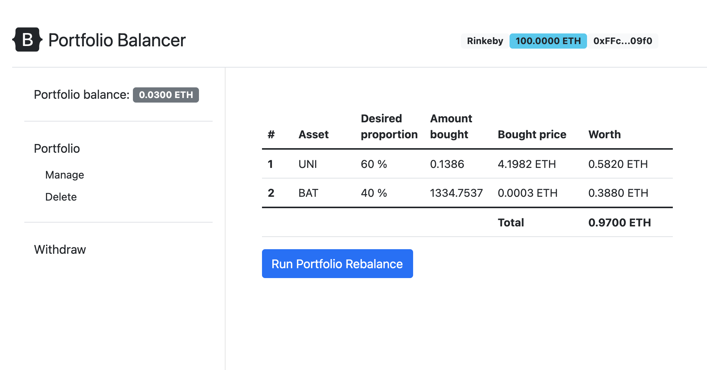

# Final project - Portfolio balancer

## Deployed version url:

https://elastic-pare-e13eee.netlify.app

## How to run this project locally:

### Prerequisites

- Truffle v5.3.7 (core: 5.3.7)
- Solidity - 0.8.6 (solc-js)
- Node v12.16.1 (you can use `nvm use v12.16.1`)
- Web3.js v1.3.6
- Ganache CLI v6.12.2
- Clone this repository: `git clone https://github.com/diasgab/blockchain-developer-bootcamp-final-project.git`

### Contracts

- On a new terminal run a forked version of Rinkeby using ganache-cli in port `8545`: `ganache-cli -d --fork https://rinkeby.infura.io/v3/<RINKEBY_INFURA_PROJECT_ID>`
- NOTE: for the purpose of testing this project and only for limited time you can use RINKEBY_INFURA_PROJECT_ID=bc260ee834fb40c588d58424b626f79b
- `cd <PROJECT_ROOT>`
- Run `npm install` in project root to install Truffle and build and smart contract dependencies
- `cp .env.example .env`
- Edit `.env` file to add RINKEBY_INFURA_PROJECT_ID parameter. For deploying to rinkeby you will need also a mnemonic with test ETH.
- Run truffle by connecting to Ganache-cli client: `truffle console --network rinkebylocal`
- Run `truffle(rinkebylocal)> compile`
- Run `truffle(rinkebylocal)> migrate --reset`
- Run `truffle(rinkebylocal)> exec scripts/add_default_tokens.js`
- Run tests in Truffle console: `truffle(rinkebylocal)> test`
- `rinkebylocal` network id is 1337, remember to change it in Metamask as well!

### Frontend

- `cd client`
- `cp ../build/contracts/Balancer.json contracts` (run this after you have run the truffle migrate command in the previous step)
- `npm install`
- `npx lite-server`
- Open `http://localhost:3000`

### How to populate locally deployed contract with allowed assets

- `truffle migrate --network rinkebylocal`
- `truffle console --network rinkebylocal`
- `exec scripts/add_default_tokens.js`
- Send ETH to local wallet: `web3.eth.sendTransaction({ from: "<your local address>", to: "<your local network wallet>", value: web3.utils.toWei("10") })`
- NOTE: you can also import a new test account from the ones generated by Ganache-cli using the private key
- `cd client && npx lite-server`
- Open local ui from `http://localhost:3000`
- Make sure your Metamask localhost network is in port `8545` and chain id is `1337`.
- If you get `TXRejectedError` when sending a transaction, reset your Metamask account from Advanced settings.

## Screencast link

PENDING

## Public Ethereum wallet for certification:

`PENDING`

## Project description

A user can create a portfolio by selecting from the assets available in Balancer contract. A portfolio consists of assets with their corresponding percentage assignment being the maximum 100%.

The main goal is to allow the user in a simple manner to keep the same risk tolerance when creating a portfolio.

Let's use a simple example to demonstrate this. A user wants to distribute 1 ETH in the following way:
- 70% into UNI token
- 30% into BAT token

What happens upon price fluctuations?

If the price of UNI token increases, then the portfolio distribution might look like this:
- 65% into UNI token
- 35% into BAT token

This is good news because the portfolio value has probably increased. But it also increased the exposure to the BAT token.

To correct this manually the user might Sell a certain amount of the BAT token and Buy a certain amount of UNI token

To make the user life easier he could run a portfolio rebalance using this tool Then by using this tool.



## Simple workflow

1. Enter balancer web site
2. Connect to Metamask
3. Deposit some ether
4. Create a portfolio
5. Run the first portfolio distribution
6. Run a portfolio rebalance any time you want
7. Delete a portfolio to receive the portfolio balances in your balance
8. Withdraw your funds

## Workflow for automatic rebalance (Not implemented)

1. Once a portfolio is created the user can select the conditions when a portfolio rebalance should happen:
   1. Every 1 hour, once a day, once a week, etc
   2. After x% increment or decrement in the expected portfolio balance
2. A user would be able to create N portfolios.
3. A user could specify which amount to assign to a portfolio
4. When deleting a portfolio a user can select whether to convert all the assets to ETH or keep the tokens

## Directory structure

- `client`: Project frontend.
- `contracts`: Smart contracts that are deployed in the Rinkeby testnet.
- `migrations`: Migration files for deploying contracts in `contracts` directory.
- `test`: Tests for smart contracts.

## Environment variables

```
RINKEBY_INFURA_PROJECT_ID=
RINKEBY_MNEMONIC=
```
RINKEBY_MNEMONIC is not needed unless you want to deploy to Rinkeby.

## TODO features

- Let the user add assets to an existing portfolio.